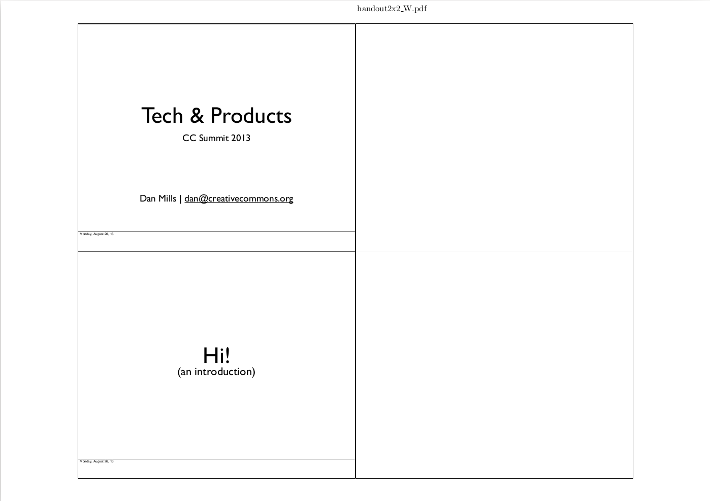

# Pdftools

## About it
Python script to:

* Merge PDF files
* Nup (or tile) pages, that is put more than one logical input pages into a single output page (e.g. print slides with 2 slides in one page)
* Number pages 
* Remove owner protection from PDF files (you are able to open the PDF without a password, but you are not able to copy / print / annotate / exc.)
* Remove metadata from PDF file
* Split one input page in 2 output pages (e.g. scanned book with 2 pages in every pdf page)
* Create slides booklet, 3 slides on the left of output page and 3 white slides on the right
* And lots more

All the operations above can be achieve togheter with a single command line.
Disover all the functionalities by running

	pdftools.py -h

## Examples
Here are few examples of what pdftools can do:

### Merge

Merge your pdf files. Create an output pdf file that contains more than one input pdf file, one after the other. Said otherwise, input pdf files are appended in the output file. pdftools also supports reading from an input directory altogether, so you don't have to pass all your files in the command line (files in the input directory are appended in natural sort). pdftools can also append image files.

### Nup

Create an output pdf file in which each page in the output pdf file contains more than one page of the input pdf file. Pages in the input pdf file can be n-upped vertically or horizontally

### Handout

Microsoft(R) Powerpoint(R) allows you to open a presentation and make an handout of it to take to class so you can write notes on it.

With pdftools you can do that too! 

For example, you can create an handout in which each page of the output pdf file is a 4x4 matrix: the left cells of the matrix contains pages from the input pdf file, while the right cells contains ... nothing! So you can use them to take notes.

See a screenshot of what you can achieve here.

Take your input slides:

Make an handout out of them

### Add text

pdftools allow you to add text to your pdf file. You can add an arbitrary text of your choice, but pdftools also allow you to add filenames, current dates, current times, current page and total pages.

You can use pdftools to add page numbers to your pdf files!

### Split it!

Do you have a scanned book in which every page of the input pdf file consists of 2 pages of your book, one left and one right?

With pdftools you can split it!

Create an output pdf file in which every page is a page of your book, by splitting every page of the input pdf file in two.

### Where can I find the examples?

All the examples listed here and much more can be found in the `examples` directory.

Take a look at this directory to learn how to achieve all of this and more!

Moreover, remember to take a llok at the documentation by calling `pdftools.py --help`.

## GUI

pdftools currently has no GUI but only a CLI.

## Requirements

* [Python](https://www.python.org/) >= 3.3
* A LaTeX distribution like [TexLive](https://www.tug.org/texlive/) or [MikTex](http://miktex.org/)
* The following packages must be available in your LaTeX distribution. You can check their presence by running

`pdftools.py --check-latex`

* [pdfpages](https://www.ctan.org/pkg/pdfpages?lang=en)
* [lastpage](https://www.ctan.org/pkg/lastpage)
* [grffile](https://www.ctan.org/pkg/grffile)
* [forloop](https://www.ctan.org/pkg/forloop)
* [fancyhdr](https://www.ctan.org/pkg/fancyhdr?lang=en)
* [textpos](https://www.ctan.org/pkg/textpos)
* [changepage](https://www.ctan.org/pkg/changepage)
